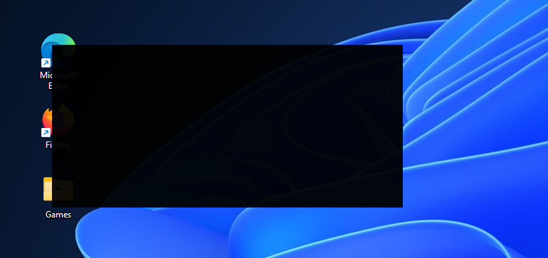

Simple win32 utility for OLED display's health




## Description
**oledSaverWin.exe** is a lightweight Win32 application designed to help prevent burn-in on OLED screens. It accomplishes this by displaying a fullscreen, semi-transparent black overlay that can dim the screen without completely obscuring it, reducing screen wear and extending the lifespan of OLED displays.

## Usage
Here are the key controls and interactions within the application:

- **Return (Enter)**: Toggles fullscreen mode on and off.
- **Double-click**: Toggles fullscreen mode on and off.
- **Escape (Esc)**: Exits fullscreen, next press hides application to the taskbar.
- **Dragging with Mouse**: Allows you to move the overlay window when not in fullscreen mode.
- **Resizing with Mouse**: Hold down SHIFT or CONTROL keys to resize window in order to cover specific areas of the screen when not in fullscreen mode.
- **Alt+F4**: To close utility

Hint: pin that utility to taskbar, and start it with Win+Number shortcut.

## Building
To build the application, use the provided `build.zig` script. This script automates the compilation process and outputs the application executable. You're free to vary alpha-blening value, or to enable application to start in full-screen mode in sources.

If you’re familiar with Visual Studio and Win32 APIs, you’ll know how to handle the code.

### Steps to Build
1. Install [Zig](https://ziglang.org/) if you haven't already.
2. Run the build script from the project directory:
   ```bash
   zig build -Doptimize=ReleaseSmall
   ```
3. After a successful build, the executable will be available in the zig-out/bin directory.